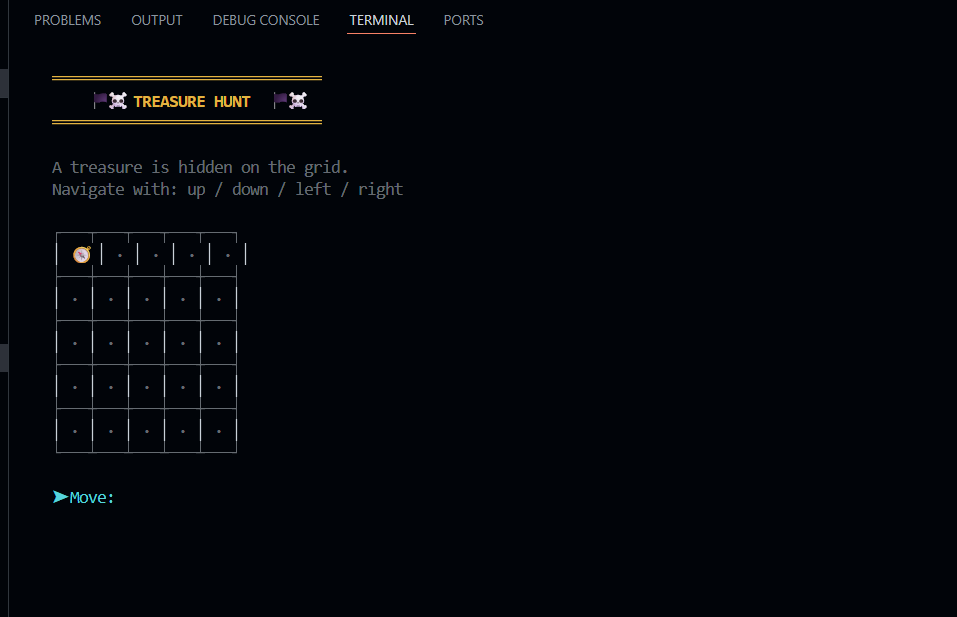
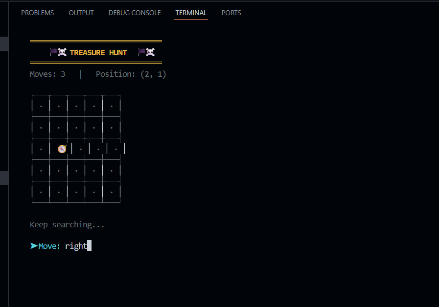
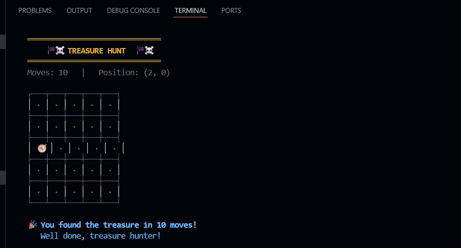

# Treasure Hunt Python

A console-based Python game where the player navigates through a 5x5 grid to find hidden treasure.

## Features
- 5x5 grid-based gameplay
- Randomly hidden treasure location
- Player movement using up, down, left, and right commands
- Boundary checking for invalid moves
- Move counter to track performance
- Colorful terminal interface

## Technologies Used
- Python
- Random module
- OS module

## Project Type
Console-Based Game

## Screenshots

### Game Start

### Gameplay

### Winning Screen

## Author
Nancy Sharma  
B.Tech CSE Student
